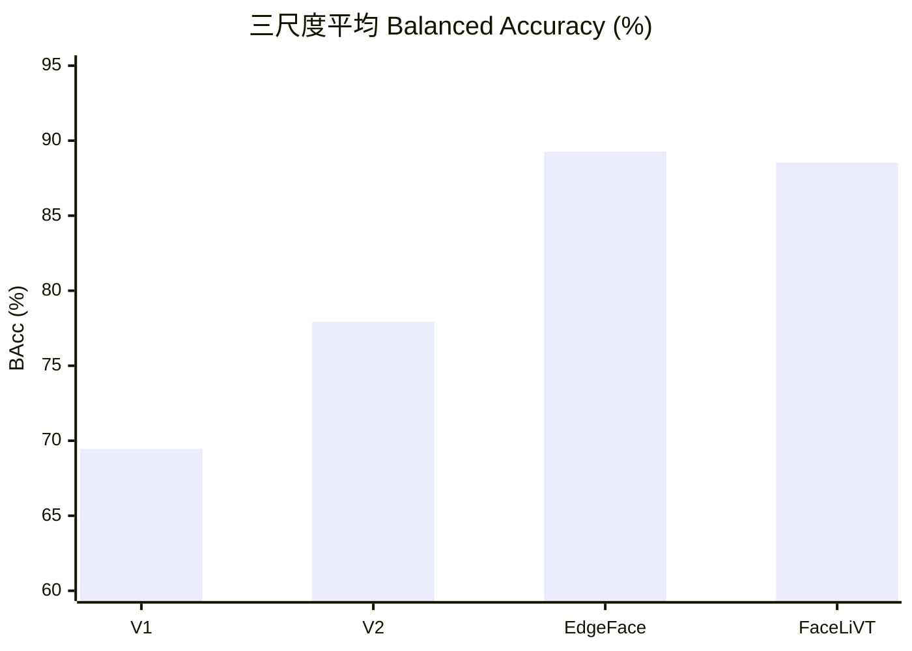

# Gender 模型 V1／V2／V3 摘要

> **結論：V3 EdgeFace-XXS 為準確度與部署候選。** 三尺度平均 Balanced Accuracy 達 **89.27%**，較現行 V1 提升 **+19.80 pp**、較 V2 提升 **+11.35 pp**。RK3588 實機 parity 通過。

## 比較

| 版本／模型 | 模型來源 | 本專案 Gender 訓練 | 80／40／27 px BAcc | 三尺度平均 | 相對 V1 提升 | RK3588 模型大小 | RK3588 mean／p95 | 結論 |
|---|---|---:|---|---:|---:|---:|---|---|
| V1 SSR-Net | [SSR-Net 官方專案](https://github.com/shamangary/SSR-Net)，Wiki Gender 權重 | 官方預訓練；本專案 epoch 不適用 | 73.06／69.61／65.73% | **69.46%** | 基準 | 0.51 MB | 1.52／2.47 ms | 現行 production baseline |
| V2 SSR-Net | 同 V1 架構與權重起點；UTKFace fine-tune | 最佳 epoch 13；early-stop epoch 18 | 77.59／79.26／76.92% | **77.92%** | **+8.46 pp** | 0.51 MB | 1.39／2.29 ms | 明顯進步，但性別召回不平衡 |
| V3 EdgeFace-XXS | [EdgeFace 官方專案](https://github.com/otroshi/edgeface)，face-recognition 預訓練 | 最佳 epoch 7；run 至 epoch 11 | 89.75／89.55／88.50% | **89.27%** | **+19.80 pp** | 4.18 MB | 7.26／9.14 ms | **Accuracy + Deployment Winner** |
| V3 FaceLiVTv2-XS | [FaceLiVT 官方專案](https://github.com/novendrastywn/FaceLiVT)，[官方權重](https://huggingface.co/novendrastywn/FaceLiVT/resolve/main/facelivtv2-xs.pt) | 最佳 epoch 8；run 至 epoch 12 | 88.98／88.34／88.24% | **88.52%** | **+19.06 pp** | 7.12 MB | 7.95／9.85 ms | 公平性佳，但 physical parity 未過 |

> BAcc 為 corrected crop contract 的 frozen external benchmark BAcc = Balanced Accuracy對二分類來說就是
**BAcc = (Male Recall+Female Recall)/2**
；每個尺度 936 張。模型大小為 RK3588 FP16 `.rknn`。

## 使用資料與資料分布

### 各版本實際使用方式

| 版本 | 起始權重／預訓練資料 | 本專案 Gender 資料與用途 |
|---|---|---|
| V1 SSR-Net | 官方 Wiki Gender checkpoint | 本專案未重新訓練；作為現行 production baseline，並在相同 frozen benchmark 上重評 |
| V2 SSR-Net | V1 Wiki Gender 權重 | 使用 UTKFace `crop_part1` fine-tune；936 張外部 benchmark source image 全數排除於訓練、validation 與 internal test |
| V3 EdgeFace-XXS | 官方 face-recognition checkpoint； | 使用與 V2 相同的 UTKFace train／validation／test split fine-tune；外部 benchmark 僅供最終評估 |
| V3 FaceLiVTv2-XS | 官方 Glint360K face-recognition 預訓練 checkpoint | 使用與 V2／EdgeFace 相同的 UTKFace split 與訓練／評估合約 |

本專案可核對的 UTKFace 資料共 **9,778 張 source images**：其中 **8,842 張**進入開發 split，另有 **936 張**封存為外部 benchmark。切分 seed 為 `20260905`，依「性別 × 年齡十歲區間」分層。

### Split 與性別分布

UTKFace 標籤 `0 = Male`、`1 = Female`。

| Split | 用途 | 總數 | Male | Female |
|---|---|---:|---:|---:|
| Train | V2／V3 參數更新 | 6,188 | 2,737（44.23%） | 3,451（55.77%） |
| Validation | checkpoint／threshold 選擇 | 1,325 | 586（44.23%） | 739（55.77%） |
| Internal test | 訓練後內部檢查 | 1,329 | 588（44.24%） | 741（55.76%） |
| Frozen external benchmark | 最終跨尺度比較，不參與訓練或 threshold 選擇 | 936 | 461（49.25%） | 475（50.75%） |

### 年齡分布

| 年齡區間 | Train | Validation | Internal test | External benchmark |
|---|---:|---:|---:|---:|
| 0–9 | 1,996 | 428 | 428 | 94 |
| 10–19 | 786 | 168 | 170 | 94 |
| 20–29 | 996 | 213 | 214 | 94 |
| 30–39 | 658 | 141 | 141 | 94 |
| 40–49 | 407 | 87 | 87 | 94 |
| 50–59 | 591 | 127 | 126 | 94 |
| 60–69 | 392 | 84 | 84 | 94 |
| 70–79 | 200 | 43 | 42 | 94 |
| 80–89 | 156 | 33 | 35 | 94 |
| 90–99 | 6 | 1 | 2 | 85 |
| 100+ | 0 | 0 | 0 | 5 |

## 準確度進步圖

